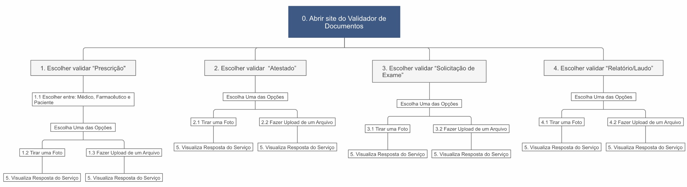
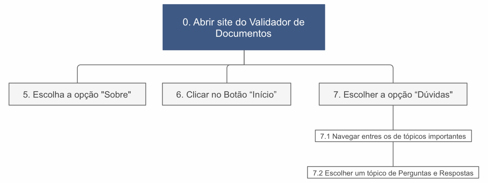

# Análise de Tarefa

## Introdução

Um dos objetivos da análise de tarefas para o projeto analisado é na definição, em um nível de abstração mais elevado, do fluxo de utilização das funcionalidades oferecidas pelo site. Para entender e identificar as necessidades do serviço web foi utilizada a análise hierárquica, onde os principais objetivos do usuário e fizemos uma decomposição das tarefas realizadas.

## Diagrama de Análise de Tarefas

### Diagrama Para Validação de Documentos Digitais

### Diagrama Para Tarefas Extras

## Referências

- BARBOSA, Simone; DINIZ, Bruno. Interação Humano-Computador, Editora Elsevier, Rio de Janeiro, 2010.
- <https://assinaturadigital.iti.gov.br/>

## Históricos de Revisões

| Data | Versão | Descrição | Autor(es) |
| :---: | :---: | :---: | :---: |
| 04/10/2020 | 1.0 | Criação do documento e referências| Marcos Raimundo |
| 04/10/2020 | 1.0 | Adição da Introdução e Diagramas de Tarefas | Marcos Raimundo |