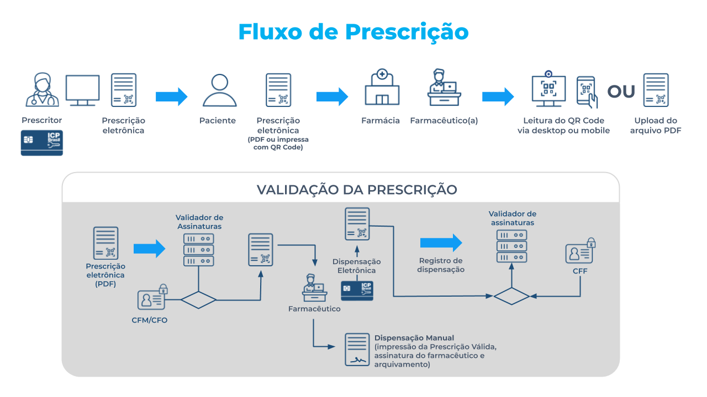

# Análise do perfil do usuário
Análise do perfil do usuário busca entender quem são os usuários e quais são os seus objetivos para desenvolver um produto que satisfaça o público alvo, respeitando suas necessidades, seus objetivos e suas preferências. 

## Metodologia
A introspecção é uma é uma técnica muito utilizada na etapa de elicitação de requisitos e análise do usuário. Nessa técnica, o designer de IHC se coloca no lugar do usuário e procura entender as funcionalidades importantes do sistema para o usuário, as necessidades e preferências do usuário e as possíveis dificuldades e dúvidas que ele pode enfrentar. Apesar de muito usada, nem sempre a introspecção traz uma visão próxima da realidade.  

## Perfil do usuário
O portal do Validador de Documentos Digitais tem como objetivo verficiar documentos digitais da área da saúde (prescrições, atestados, solicitações de exame e laudos). Na verificação, é possível verificar se o documento foi assinado por um profissional habilitado, se foi fraudado ou não e se foi dispensado por um farmacêutico. Tendo isso em mente, o público alvo do portal são:
- Médicos e cirurgiões dentistas (prescritores): utilizarão do site para verificar se o documento assinado foi assinado corretamente.
- Pacientes: utilizarão para verificar se o documento recebido é válido e integro.
- Farmacêuticos: utilizarão para verificar se o documento não foi fraudado e é assinado por um profissional habilitado.

## Fluxo de um documento digital

